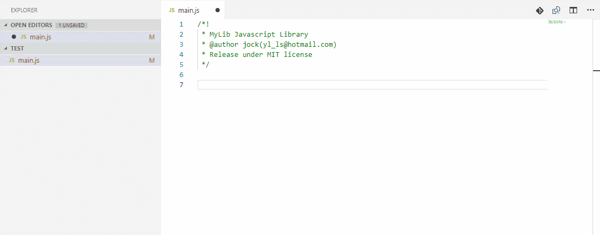
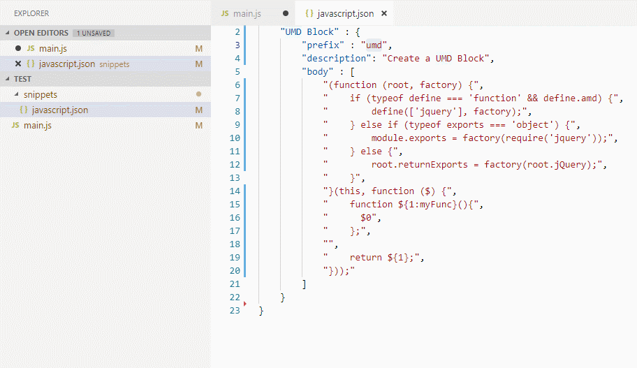
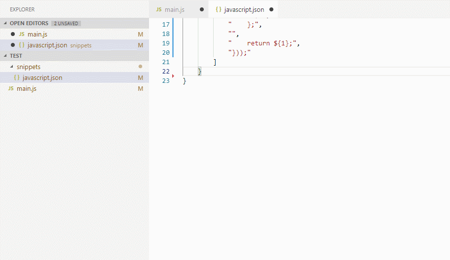

# Snippet in project

Create snippet base your project dir & Insert snippet outside.

**We strongly recommend that you understand the [Snippet Syntax](https://code.visualstudio.com/docs/editor/userdefinedsnippets#_snippet-syntax) before using this extension.**

## Features

**These features can be used in any language and not just for JavaScript.**

### Create in project snippet by your code

1. Select the code what you need be a snippet.
2. In Context Menu Select `Create In-Project Snippet`.
3. Edit new Snippet Display Name and input keys(prefix).
4. Now you can use the `prefix` in you project!

### Insert snippet outside

1. Select the code what you need be a snippet inside.
2. In *Context Menu* or use hotkey select `Insert Snippet Outside`.

### Fast edit snippet & use it

1. In any `.json` file match `snippets/[languageId].json`.
2. Input `snippet` and touch `Tab` start snippet.
3. Try new Snippet by input `prefix` chars in editor(No require saved snippets json file).

## Release Snippet Power
The vscode code snippet can do more. Check vscode doc links below get full power:
* [Creating your own snippets](https://code.visualstudio.com/docs/editor/userdefinedsnippets#_creating-your-own-snippets)

## Why Snippet in project
* Save all your project target snippet in project dir.

## Bug Report
[Github Issues](https://github.com/lishu/vscode-snippets-project/issues)

## Donations
[Buy me a cup of coffee.](https://www.paypal.me/jockli)

**Enjoy!**